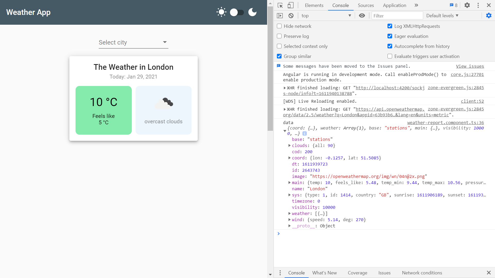
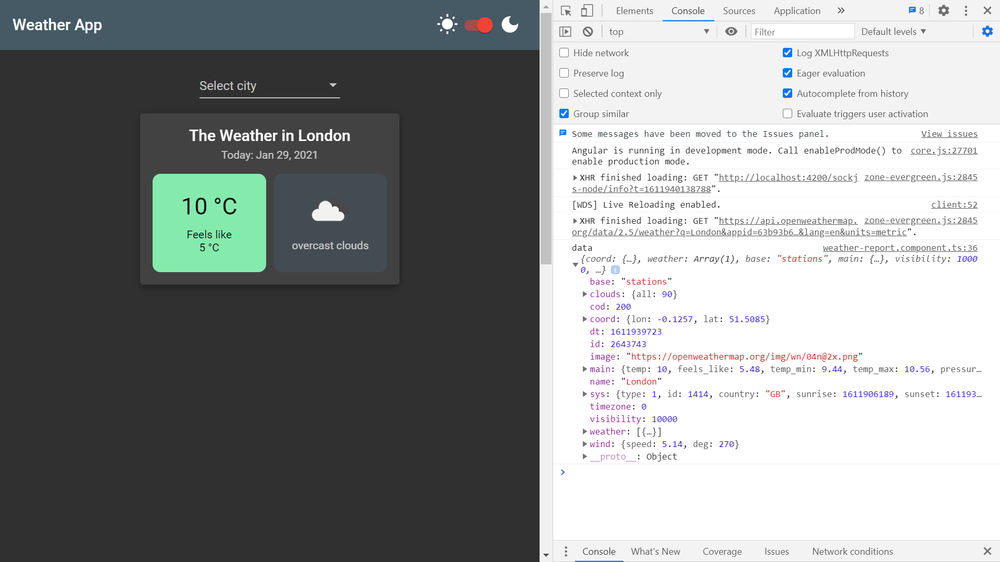

# :zap: Angular Material Table

* App displays weather from the [OpenWeather API](https://home.openweathermap.org/)
* Uses the [Angular Material design component library](https://material.angular.io/) to add a dark mode

*** Note: to open web links in a new window use: _ctrl+click on link_**

## :page_facing_up: Table of contents

* [:zap: Angular Material Table](#zap-angular-material-table)
  * [:page_facing_up: Table of contents](#page_facing_up-table-of-contents)
  * [:books: General info](#books-general-info)
  * [:camera: Screenshots](#camera-screenshots)
  * [:signal_strength: Technologies](#signal_strength-technologies)
  * [:floppy_disk: Setup](#floppy_disk-setup)
  * [:computer: Code Examples](#computer-code-examples)
  * [:cool: Features](#cool-features)
  * [:clipboard: Status & To-Do List](#clipboard-status--to-do-list)
  * [:clap: Inspiration](#clap-inspiration)
  * [:envelope: Contact](#envelope-contact)

## :books: General info

* [Angular standard dark theme](https://material.angular.io/guide/theming) used

## :camera: Screenshots




## :signal_strength: Technologies

* [Angular v11](https://angular.io/)
* [Angular Material v11](https://material.angular.io/)
* [RxJS takeUntil](https://www.learnrxjs.io/learn-rxjs/operators/filtering/takeuntil) used to emit values until provided observable limits - until $Unsubscribe in this case
* [RxJS Subject](https://www.learnrxjs.io/learn-rxjs/subjects/subject#a-special-type-of-observable-which-shares-a-single-execution-path-among-observers) used to share an execution path among observers
* [RxJS Filter](https://www.learnrxjs.io/learn-rxjs/operators/filtering/filter) to emit only selected values

## :floppy_disk: Setup

* Install dependencies using `npm i`
* Sign up with [OpenWeather API](https://home.openweathermap.org/), get a free API key and add it to the environment files
* Run `ng serve` for a dev server. Navigate to `http://localhost:4200/`. The app will automatically reload if you change any of the source files.
* Run `ng build` to build the project. The build artifacts will be stored in the `dist/` directory. Use the `--prod` flag for a production build.

## :computer: Code Examples

```typescript
  // Function that takes a city name as input and returns an Observable using a Weather interface
  getWeatherForCity(city: string): Observable<Weather> {
    const params = new HttpParams({ fromObject: { q: city } });

    return this.httpGet<Weather>('weather', params).pipe(
      map((data: Weather) => ({
        ...data,
        image: `https://openweathermap.org/img/wn/${data.weather[0].icon}@2x.png`,
      })),
      delay(500)
    );
  }

  private httpGet<T>(url: string, params: HttpParams): Observable<T> {
    params = params.append('appid', environment.apiKey);
    params = params.append('lang', 'en');
    params = params.append('units', 'metric');
    return this.http.get<T>(`${this.baseUrl}/data/2.5/weather`, { params });
  }
```

## :cool: Features

* dark mode toggle

## :clipboard: Status & To-Do List

* Status: Working.
* To-Do: Add Unsplash image of clouds etc. - depending on API weather response

## :clap: Inspiration

* [Angular Material Darkmode in 3 Steps](https://zoaibkhan.com/blog/angular-material-dark-mode-in-3-steps/)
* [Angular Weather App RxJS in Angular](https://zoaibkhan.com/blog/rxjs-in-angular-creating-a-weather-app/)

## :envelope: Contact

* Repo created by [ABateman](https://www.andrewbateman.org) - you are welcome to [send me a message](https://andrewbateman.org/contact)
